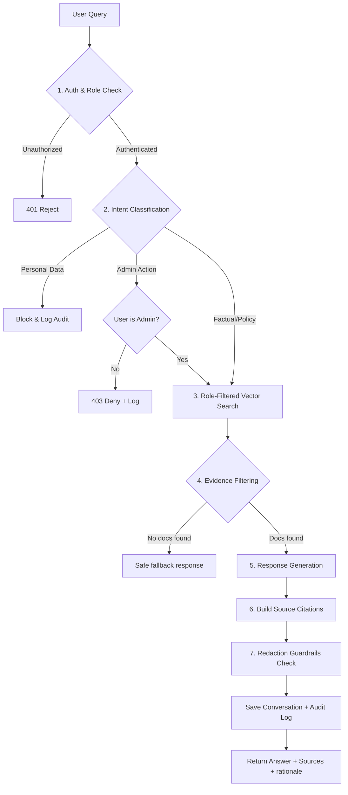
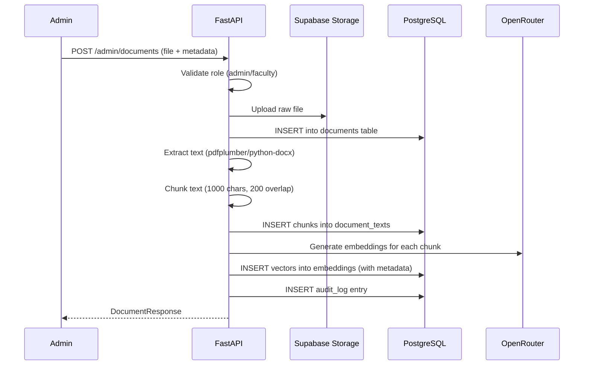
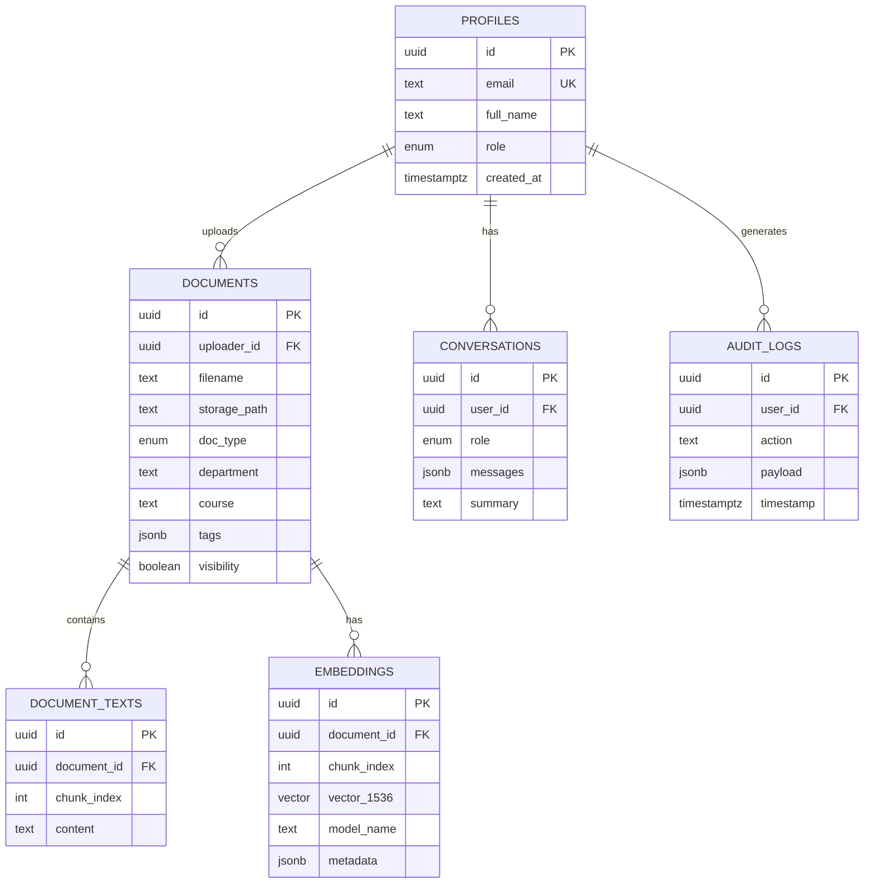

# UniGPT Design Document — Agent Pipeline & Data Flow

## Architecture Overview

UniGPT follows a modular full-stack architecture:

```
┌──────────────────────────────────────────────────────────────────┐
│  Frontend (web/)                                                 │
│  React + Vite + TypeScript + Tailwind + Framer Motion            │
│  ┌──────────┐ ┌──────────┐ ┌──────────────┐ ┌───────────────┐   │
│  │ Landing   │ │ Auth     │ │ Dashboards   │ │ Chat Widget   │   │
│  │ Page      │ │ Pages    │ │ (role-based) │ │ (persistent)  │   │
│  └──────────┘ └──────────┘ └──────────────┘ └───────────────┘   │
└───────────────────────────┬──────────────────────────────────────┘
                            │ HTTP / JWT Auth
┌───────────────────────────▼──────────────────────────────────────┐
│  Backend (api/)                                                  │
│  FastAPI + Python 3.11 + Pydantic                                │
│  ┌─────────────┐ ┌──────────────┐ ┌──────────────────────┐      │
│  │ Auth Router  │ │ Docs Router  │ │ Agent Router         │      │
│  │ /auth/*      │ │ /documents/* │ │ /agent/query         │      │
│  │ /user/me     │ │ /admin/docs  │ │ /agent/history       │      │
│  └─────────────┘ └──────────────┘ └──────────────────────┘      │
│  ┌─────────────┐ ┌──────────────┐ ┌──────────────────────┐      │
│  │ Auth MW     │ │ RBAC MW      │ │ Agent Pipeline       │      │
│  │ JWT verify  │ │ Role check   │ │ RAG orchestrator     │      │
│  └─────────────┘ └──────────────┘ └──────────────────────┘      │
└──────┬──────────────────────┬─────────────────────┬─────────────┘
       │                      │                     │
       ▼                      ▼                     ▼
┌──────────────┐  ┌───────────────────┐  ┌────────────────────┐
│ Supabase     │  │ Supabase Storage  │  │ OpenRouter LLM     │
│ PostgreSQL   │  │ (raw files)       │  │ (via LangChain)    │
│ + pgvector   │  │                   │  │                    │
└──────────────┘  └───────────────────┘  └────────────────────┘
```

## Agent Pipeline (RAG Orchestrator)

The agent pipeline processes every query through this sequence:



### Step Details

| Step | Component | Description |
|------|-----------|-------------|
| 1 | `middleware/auth.py` | Validate JWT, extract user ID, fetch role from `profiles` table |
| 2 | `agent_pipeline.classify_intent()` | Deterministic keyword classifier: factual / policy / personal / admin |
| 3 | `agent_pipeline.search_embeddings()` | pgvector cosine similarity with metadata filter `role ∈ allowed_types` |
| 4 | Evidence Check | Require ≥1 matched chunk within user's role scope |
| 5 | `agent_pipeline.generate_response()` | LangChain → OpenRouter LLM with system prompt + context chunks |
| 6 | Citation Builder | Extract document ID, title, snippet for each source |
| 7 | Redaction | Block student access to faculty/admin content; log escalation |

## Document Upload Flow



## Role-Based Access Matrix

| Resource | Student | Faculty | Admin |
|----------|---------|---------|-------|
| Student docs | ✅ Read | ❌ | ✅ Full |
| Faculty docs | ❌ | ✅ Read/Write | ✅ Full |
| Admin docs | ❌ | ❌ | ✅ Full |
| Public docs | ✅ Read | ✅ Read | ✅ Full |
| Upload docs | ❌ | ✅ Faculty/Public | ✅ All types |
| User management | ❌ | ❌ | ✅ |
| Audit logs | ❌ | ❌ | ✅ |

## Database Relationships



## LangChain + OpenRouter Configuration

```python
# LLM (Chat completion)
from langchain_openai import ChatOpenAI
llm = ChatOpenAI(
    model="meta-llama/llama-3.1-70b-instruct",  # via OPENROUTER_MODEL env
    openai_api_key=OPENROUTER_API_KEY,
    openai_api_base="https://openrouter.ai/api/v1",
    temperature=0.3,
    max_tokens=1500,
)

# Embeddings
from langchain_openai import OpenAIEmbeddings
embeddings = OpenAIEmbeddings(
    model="openai/text-embedding-3-small",  # via OPENROUTER_EMBEDDING_MODEL env
    openai_api_key=OPENROUTER_API_KEY,
    openai_api_base="https://openrouter.ai/api/v1",
)
```

## Security Principles

1. **All queries include role filter** — `metadata.role ∈ allowed_roles_for_user`
2. **Never return raw admin/faculty content to students**
3. **Sensitive data requests blocked** — "my grades", "my GPA" → refuse + audit log
4. **JWT validation on every request** — Supabase JWT decoded with shared secret
5. **Audit trail** — Every upload, query, and admin action logged
6. **Mock mode** — `MOCK_LLM=true` disables real API calls for dev/testing
